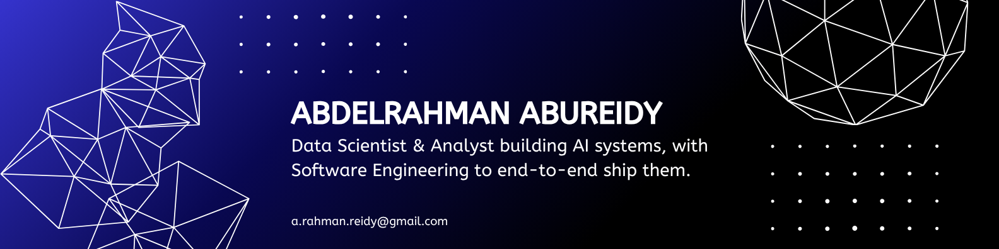

## 🙋🏻‍♂️ About Me

I'm a **Data Scientist & Analyst** who builds **AI systems**, with the software engineering to ship them end to end.

My degree is in Computer Science (Data Analytics) and I came into engineering through data, SQL, dimensional modelling, dashboards and forecasting. Today I work as an AI/Software Engineer on a multi-tenant SaaS platform, which means I get to do both: find the answer in the data, then build the system that delivers it to the people who need it.

- 🔭 **By day**: building AI features on a multi-tenant SaaS platform (Django · PostgreSQL · Next.js · AWS)
- 📈 **Alongside that**: building analytics projects on real business problems such as revenue, retention, cohorts and conversion funnels, turning company data into decisions rather than dashboards
- 🎓 **BSc (Hons) Computer Science, Data Analytics**: Asia Pacific University & De Montfort University
- 🌏 **Based in** Kuala Lumpur, Malaysia (GMT+8)
- 💬 **Ask me about** turning a business question into a query, a dashboard, or a model and knowing which one it needed

## 🧭 What I Work On

| 📊 Data & Analytics | 🤖 AI & Engineering |
| --- | --- |
| SQL, joins, window functions, CTEs | Retrieval-Augmented Generation (RAG) |
| Data modelling & warehousing (star schema, OLAP, MDX) | Vector search & embeddings (pgvector) |
| Dashboards & reporting (Power BI, Tableau) | LLM integration & evaluation harnesses |
| ETL pipelines & data quality | AI agents and tool calling |
| Statistical analysis & forecasting | Document AI & OCR pipelines |
| Web & product analytics (GA4, funnels, cohorts) | REST APIs, multi-tenant backends, cloud deployment |

The overlap between those two columns is where I'm most useful. The answer still has to be *right*, not just generated.

## 📊 Portfolio

Welcome! My detailed project portfolio, business questions, methods, findings and recommendations, lives here:

### 👉 **[Abdelrahman's Portfolio](https://github.com/AbdelrahmanAbuReidy/Portfolio)**

## 🛠️ Tools

**Data & Analytics**

**Databases & Pipelines**

**AI & Machine Learning**

**Engineering & Cloud**

## 👋🏻 Connect With Me

I'm always happy to talk about data, AI, or an interesting problem.

